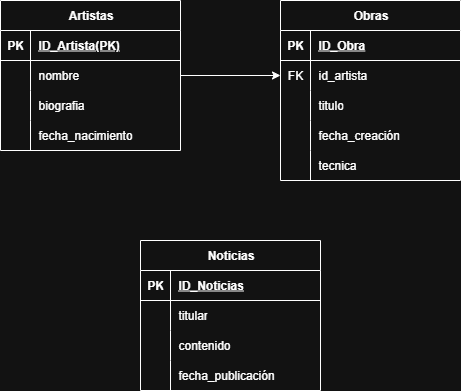

Artistas: Almacenará información sobre cada artista (nombre, biografía, etc.).

Obras: Contendrá los detalles de cada obra de arte (título, año, técnica) y se relacionará con un artista.

Noticias: Guardará los artículos que muestras en la página de inicio.

[ Artistas ]--< (crea) >--[ Obras ]

  (1)      (Muchos)

  - id_artista (PK)        - id_obra (PK)
  - nombre                 - titulo
  - biografia              - anio
  - fecha_nacimiento       - id_artista (FK)

[ Noticias ]

  - id_noticia (PK)
  - titular
  - contenido
  - fecha_publicacion

  